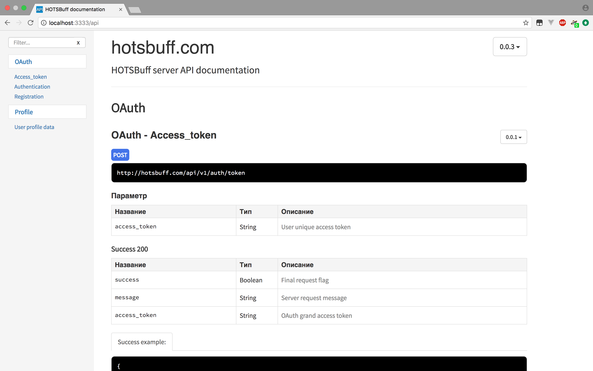

# HOSTBuff Web Application #

Клиент: Vue.js + Vuetify.js 

Сервер: Node.js + Express.js

### Установка ###
Копируем репозиторий себе на локальную машину, идем в директорию с проектом и устанавливаем `npm` пакеты:

    $ git clone git@bitbucket.org:creativeloundge/hots-web.git
    $ cd hots-web
    $ npm i

### Запуск приложения ###

##### Клиент
Во-первых для корректной работы необходим работающий сервер с MongoDB(доступный по 27017 порту). 
После установки всех пакетов необходимо собрать сервер с клиентом:

    $ npm run watch
    ...
    [16:21:13] Finished 'default' after 24 μs
    [16:21:13] http server alive, running on : http://127.0.0.1:3000

После сборки скрипт автоматически попытается открыть браузер(советую использовать `Google Chrome`) и прогрузить страницу с клиентским приложением. Приложение использует `gulp` в качестве таск-менеджера.

##### Сервер
Запуск локального сервера происходит аналогично клиенту:

    $ npm run watch:server
    > template@0.0.1 watch:server /Users/aleksandrzinin/env/development/Another.js/second
    > nodemon -e ts --exec "npm run compile"
     
    [nodemon] 1.14.12
    [nodemon] to restart at any time, enter `rs`
    [nodemon] watching: *.*
    [nodemon] starting `npm run compile`
     
    up and running @: User.dyn.westhome.spb.ru on port: 3333

Компиляция `TypeScript` происходит непосредственно перед каждым запуском приложения, а за непрерывной работой следит утилита `nodemon`.

### REST API ###

Получить подробную информацию о методах API можно непосредственно на локальном сервере. Для этого необходимо лишь выполнить скрипт:
 
    $ npm run document:server
    > template@0.0.1 document:server /Users/username/env/development/hots-web
    > apidoc -i server/ -o documentation/
     
    info: Done.

После этого необходимо запустить сервер снова и перейти на `/api`, где можно будет ознакомиться со всей информацией, которая касается REST.

### Планы ###

- [x] Создать API для мобильных приложений
- [x] Добавить OAuth1.0 авторизацию
- [ ] Переписать клиент в SPA на Vue.js 
- [ ] Интегрировать `Battle.net` сервисы 
- [ ] Разбить клиент и сервер в разные репозитории
- [ ] Разработать сервис обработки данных из игры

Задачи на текущий спринт можно посмотреть во вкладке `Boards` - скучно точно не будет.  
